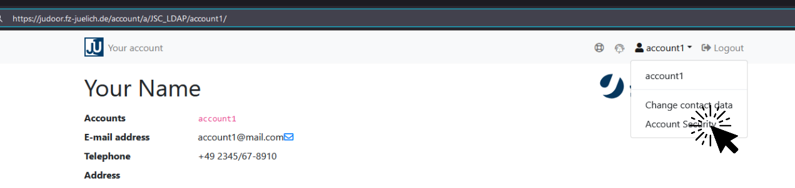
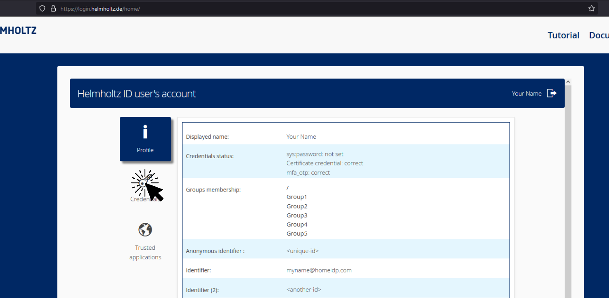
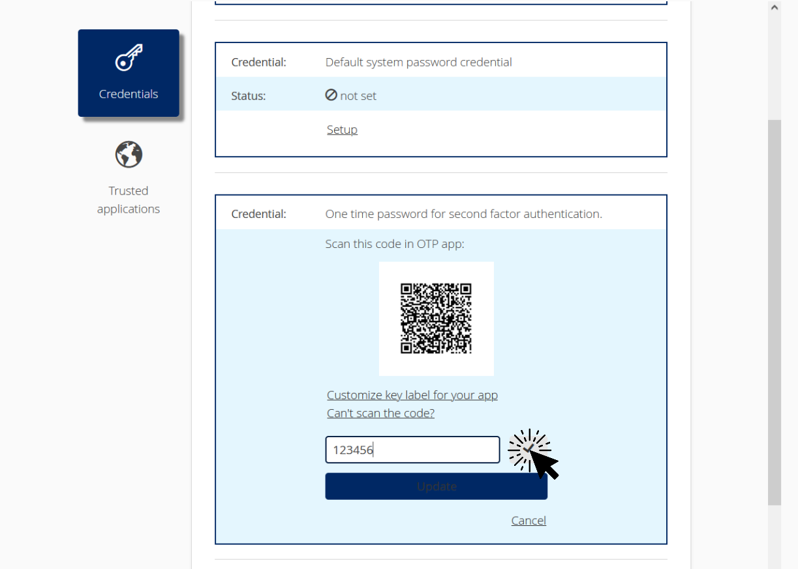

Introduction to 2-Factor Authentication

<!-- First Block: Introduction -->
<h2 style="text-align:center"><strong>Introduction</strong></h2>

  

    
  

  

    

      2-Factor Authentication (2FA), sometimes referred to as two-factor verification, is a security method in which you provide <strong>two different authentication factors</strong> to identify yourself at login. This process is <strong>performed to better protect</strong> both your credentials and the resources that you can access.
    

    

      In the <strong>first login step</strong>, you start with the usual entry of a good password. The service then confirms the correctness of the password entered. This does not, however, lead directly to the desired entrance - but to a further barrier.
    

    

      The <strong>second login step</strong> prevents unauthorized third parties from gaining access to your account just because they might have stolen your password. A quite common 2nd-factor is a <strong>One-Time Password (OTP)</strong> generated by a so-called <strong>OTP-App</strong> you install and initialize once on one of your personal devices. This <em>OTP-app</em> then provides (in our case every 30 seconds) a new <em>one-time password</em> that needs to be entered on the login page.
    

  

  

<!-- Second Block: Basic Principle -->
<h2 style="text-align:center"><strong>Basic Principle</strong></h2>

  

    

      These two factors for authentication combine the building blocks <strong>knowledge</strong> and <strong>possession</strong> in the login procedure.
    

    <ul>
      <li><strong>Knowledge</strong> - The secret knowledge is the password you enter.</li>
      <li><strong>Possession</strong> - With the <em>one-time password</em> you show that you are in possession of a certain device (e.g., your smartphone), because only the <em>OTP-App</em>, installed on that device, can generate it.</li>
    </ul>
  

  

    <video controls src="https://multimedia.gsb.bund.de/BSI/Video/2-Faktor-Authentisierung_SD.conv.mp4" style="float:right; width: 480px; max-width: 1600px"></video>
    
Source: Bundesamt für Sicherheit in der Informationstechnik

  

  

<!-- Third Block: Algorithm -->
<h2 style="text-align:center"><strong>Algorithm</strong></h2>

  

    
  

  

    

      The <strong>OTP-App</strong> can calculate personal one-time passwords completely autonomously from the outside world using a standardized and open algorithm for the generation of <strong>Time-based One-Time Passwords (TOTP)</strong>.
    

    

      The <em>TOTP algorithm</em> was published in 2011 by the <a href="https://www.ietf.com">Internet Engineering Task Force (IETF)</a> as <a href="https://tools.ietf.org/html/rfc6238">RFC 6238</a>. The <em>TOTP algorithm</em> is a hash function in which a secret code is hashed together with the current time.
    

    

      Behind the hash function is the HMAC-based One-time Password Algorithm according to <a href="https://tools.ietf.org/html/rfc4226">RFC 4226</a> - in simple terms nothing more than a standard that forms a hash in a certain way.
    

    

      The calculation includes both a <strong>"secret initialization code"</strong>, that is known to both the server and the client, and the <strong>current time</strong>. The final <em>one-time password</em> is generated from these two inputs and is valid for a certain period of time (in our case for <strong>30 seconds</strong>). The procedure can be implemented in such a way that slight differences in time between client and server are accepted.
    

    

      Hence, any <em>one-time password</em> is time-based, calculated locally, and always unique.
    

  

>Two-factor authentication is not implemented by Jupyter4NFDI or JSC-Login. Instead, you need to enable it in **JuDoor** (if you are logging in with a JSC account) or through the **Helmholtz AAI**. Below, we will outline the activation process for both services.

## Setup

2-Factor Authentication (2FA) better protects both your user credentials and the resources that you can access. **JuDoor** and **Helmholtz AAI** both use the time-based One-Time Password (OTP) generated by an OTP-App as a 2nd factor.

### Install an OTP-App
On one of your personal devices (e.g., your smartphone), install an OTP-App:  
- [**FreeOTP**](https://freeotp.github.io) (iOS, Android)  
- [**KeeWeb**](https://keeweb.info) (Linux, macOS, Windows, Online)  

More Apps. Free, but closed source:

<ul>
  <li>Authy (iOS, Android, Windows, macOS, Linux)</li>
  <li>Protectimus Smart OTP (iOS, Android)</li>
  <li>Google Authenticator (iOS, Android )</li>
  <li>Microsoft Authenticator (iOS, Android, Windows 10 Mobile)</li>
</ul>

### Option A: JuDoor
1. Visit <a target=_blank href="https://judoor.fz-juelich.de">JuDoor</a> and sign-in using your JSC account.
2. In the top right corner, open the dropdown menu and click on **Account Security**.
  

    
  

3. Click on **Start MFA Setup...**
4. Scan the QR Code (for OTP-App on phones), or enter the Secret into your installed **OTP-App**.
5. Enter your current **JSC account password** into _Current password for account1_.
6. Enter the current **One-Time-Password** (generated by your OTP-App) into the field below.
7. **DOWNLOAD AND PRINT THE SHOWN RESET CODES**

### Option B: Helmholtz AAI
1. Visit <a target=_blank href="https://login.helmholtz.de/home/">Helmholtz AAI</a> and sign-in using your home IdP.
2. Select Credentials in the left sidebar.
  

    
  

3. Activate _Enable two-step authentication if possible_
  

    
  

4. Click _Setup_ for _One time password for second factor authentication_
  

    
  

5. Scan the QR Code (for OTP-App on phones), or click _Can't scan the code_ and enter the secret into your installed **OTP-App**.
6. Enter the current **One-Time-Password** (generated by your OTP-App) and click on the checkmark.
  

    
  

## Disable 2-Factor authentication

To disable 2FA you have to disable it at **JuDoor** / **Helmholtz AAI**.

### JuDoor
1. Visit <a target=_blank href="https://judoor.fz-juelich.de">JuDoor</a> and sign-in using your JSC account.
2. In the top right corner, open the dropdown menu and click on **Account Security**.
  

    
  

3. Click on **Disable MFA...**
4. Option A: _Use second factor_ - requires your OTP-App.  
   Option B: _Use reset code_ - requires your reset codes.

### Helmholtz AAI
1. Visit <a target=_blank href="https://login.helmholtz.de/home/">Helmholtz AAI</a> and sign-in using your home IdP.
2. Select Credentials in the left sidebar.
  

    
  

3. **Disable**  _Enable two-step authentication if possible_
  

    
  

> You can disable 2FA on Helmholtz AAI, but you cannot delete the secret yourself. For assistance with removal, please contact their support team ( support at hifis.net ).