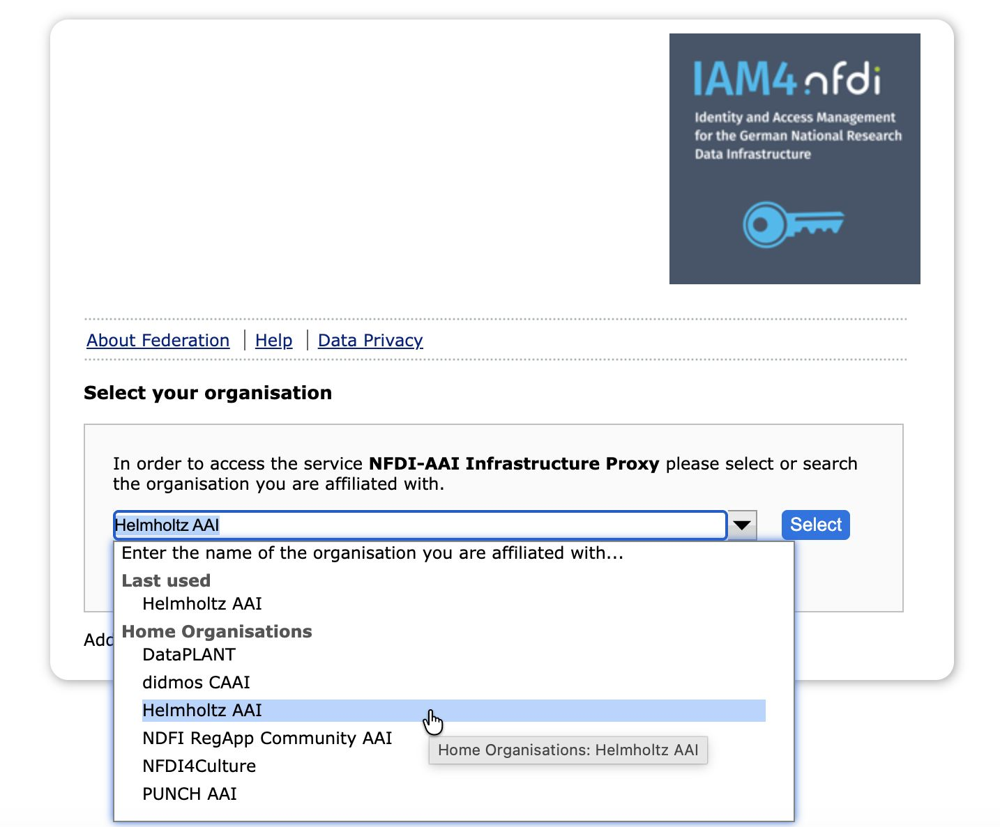
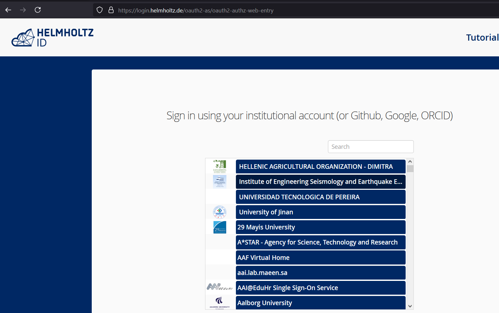
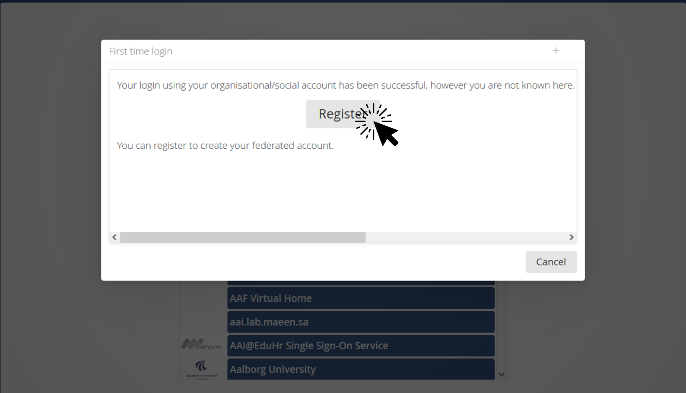
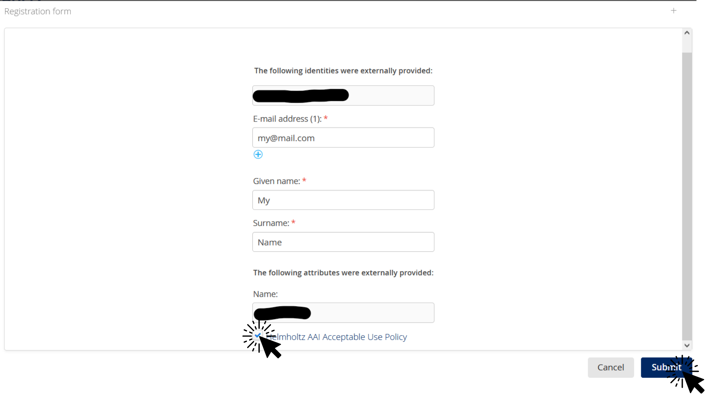
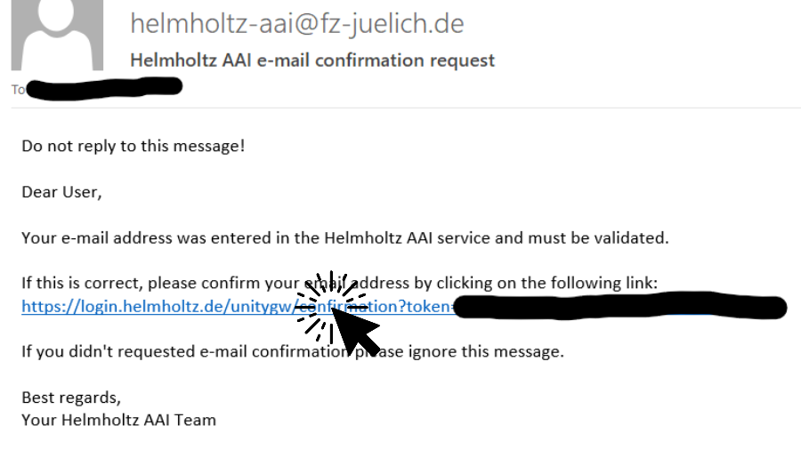
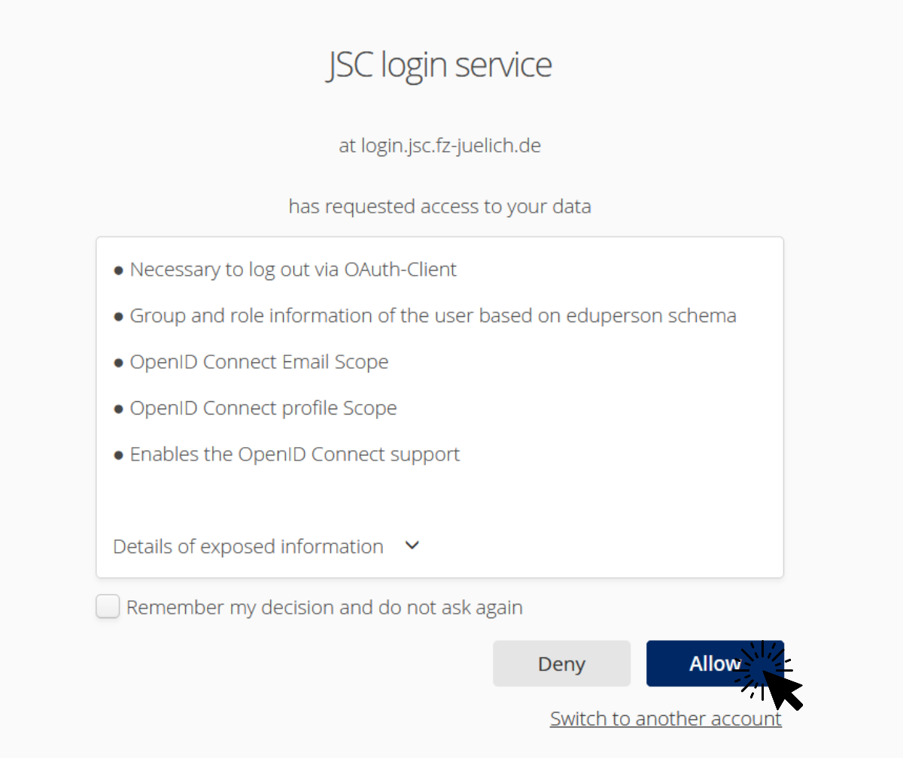

# Jupyter4NFDI Login 

## The NFDI Infrastructure Proxy

Jupyter4NFDI relies on the [**NFDI Infrastructure Proxy**](https://doc.nfdi-aai.de/infraproxy/) for user authentication. To log in, users first select a suitable AAI from a list of options. 

  

The choice will depend on which AAI(s) the user's institution or community is connected to, or, for users without an institutional affiliation, whether the AAI also offers login via social IdPs. Next, the users go through the steps of logging in (and possibly registering), which are specific to the selected AAI. As an example, a description of the login process using the Helmholtz AAI is provided below.

If not sure which AAI to choose, ask your institution/community about their AAI affiliation, or use Helmholtz AAI, as many institutions are connected to it and it also offers log in via GitHub, Google, ORCID.

## Example: Log in via Helmholtz AAI

The Helmholtz AAI is a federated login that provides a wide selection of identity providers (IdPs), allowing users to log in with institutional credentials or social IdPs, like GitHub, Google or ORCID.
> A complete list of connected organizations is available [here](https://hifis.net/doc/helmholtz-aai/list-of-connected-organisations/#edugain).

> The web pages displayed during your initial registration may differ from the screenshots in this documentation. The registration process is handled by Helmholtz ID or the connected identity providers, so updates may change the appearance of these pages.

### 1. On the Jupyter4NFDI Login Page, select Helmholtz AAI 

Go to [hub.nfdi-jupyter.de](https://hub.nfdi-jupyter.de) and click the **Sign In** button. In the NFDI Infra Proxy dialogue, select **Helmholtz AAI**, as shown in the previous screenshot.

### 2. Sign via Home IdP or Social IdP

Choose the Identity Provider (IdP) you would like to use. Use the search field to find your provider and login using the credentials of your provider.
> If you encounter an error message after this step, it means that your Identity Provider (IdP) has not provided the necessary attributes to the Helmholtz ID. In this case, reach out to your IdP to request that they address the issue. If they need further assistance, they can contact the Helmholtz ID administrators directly.

  

##### Register at Helmholtz ID

  
If you're a first-time user of Helmholtz ID, you'll be prompted to register. Click to expand for more information.

  

Depending on the attributes sent by your Identity Provider to Helmholtz ID, you may need to provide additional information, such as your email address. You will also need to read and accept the Acceptable Use Policy.

  

Your registration request has been submitted. You will receive an email with a link that you need to click to confirm your email address.

  

After your account registration was successful you have to [login](#1-visit-the-Jupyter4NFDI-login-page) once more.

### 3. Consent confirmation

You need to confirm that you agree to allow the Helmholtz ID service to use the information provided by the Identity Provider.

> The information displayed on this page is what Jupyter4NFDI will receive from the AAI. This data is used to determine your access to specific resources. If you need additional attributes to be sent to Jupyter4NFDI, please request your Identity Provider to follow the [AARC-G002](https://aarc-community.org/guidelines/aarc-g002/) guidelines and include the necessary information in the _eduPersonEntitlement_ attribute.

  

### FAQ

### Why can't I change the account in Helmholtz ID
When you click on Logout in Jupyter4NFDI, you will be logged out from Jupyter4NFDI, but you will remain logged into the Helmholtz ID service. To log out from Helmholtz ID, please visit the Helmholtz ID [website](https://login.helmholtz.de/home) and click on Logout. Afterward, you will have the option to choose a different provider during the login process.

### How do I get access to a system
More information about access to the systems is documented [here](features.md#1-systems-available).
