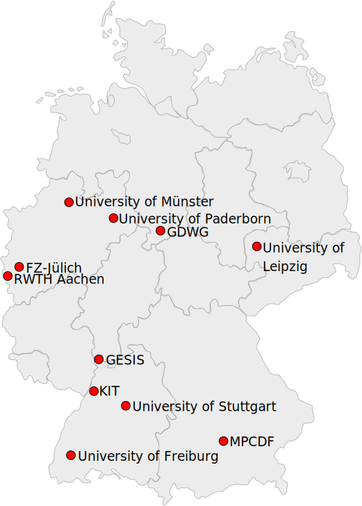

# Statistics about the Jupyter Services collected

Currently, **11** providers host **12** Jupyter services:

<figure markdown>
{ width="450" }
    <figcaption>Map of Jupyter Providers in Germany</figcaption>
</figure>

The following NFDI consortia contribute to one or more of the collected services:

::cards:: cols=2

- title: " "
  image: assets/nfdi4ds_logo.png
- title: " "
  image: assets/DataPLANT_logo.svg
  
::/cards::

::cards:: cols=2 class_name="smaller"
  
- title: " "
  image: assets/nfdi4bioimage_logo.png
- title: " "
  image: assets/nfdi4ing_logo.png

::/cards::

Curious about further statistics? Come back later - there's more to come!

<!--
In total, the collected Jupyter Services provide XXX CPUs and XXX RAM to researchers. 
 
Currently, on average XXX users use Jupyter per day.
-->
