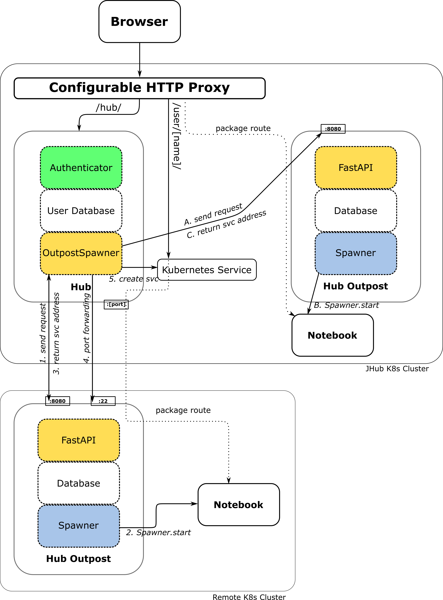
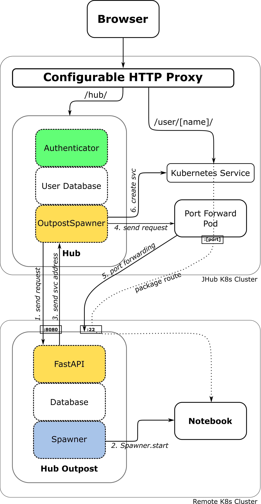

# JupyterHub Outpost Architecture

Understanding the JupyterHub Outpost architecture will help you set up and manage Outpost instances effectively, while ensuring your resources remain secure.  
The architecture is divided into two main components: **Local Cluster Components** (associated with the Central JupyterHub) and **Remote Cluster Components** (related to the JupyterHub Outpost installed on a separate cluster from the Central JupyterHub).

## Local Cluster Components

The following key components are part of the central JupyterHub.
> It's recommended to run it on a Kubernetes cluster. Other setups will work as well, but are not covered in this section.

<h3>1. <strong><a href="https://github.com/kreuzert/jupyterhub-outpostspawner">OutpostSpawner</a></strong></h3>

The OutpostSpawner takes on a user's start request for a jupyter server. Instead of starting the server locally, it communicates with a JupyterHub Outpost REST API. It can be used with multiple JupyterHub Outposts, allowing the central JupyterHub to support countless remote systems. For more information look into the OutpostSpawner [documentation](https://jupyterhub-outpostspawner.readthedocs.io/en/latest/).

<h3>2. <strong><a href="https://kubernetes.io/docs/concepts/services-networking/service/">Kubernetes Service</a></strong> (optional) </h3>

Each Jupyter server of a user will receive it's own Kubernetes Service. JupyterHub will be able to communicate with the remote Jupyter server via this local Kubernetes Service, by creating a ssh tunnel to the JupyterHub Outpost.

> If the Jupyter server of a user is reachable from the outside world, e.g. through a Proxy on the remote cluster, it is not required.

## Remote Cluster Components

<h3>1. <strong>JupyterHub Outpost</strong></h3>
The Outpost manages the users Jupyter Servers. It can be configured with any Spawner and has a additional features allowing administrators to be in charge of their own resources. For more information, check the [installation](installation.md) and [configuration](configuration.md) sections.  

> It is recommended to install the JupyterHub Outpost on a Kubernetes cluster using this [Helm Chart](https://artifacthub.io/packages/helm/jupyter-jsc/jupyterhub-outpost). Other setups like docker swarm will work as well, but might require some extra steps.  

## Outpost Setup Scenarios

The diagrams below illustrate various setup configurations with the JupyterHub Outpost. You have the flexibility to add as many systems and Outposts to the architecture as needed.
> Check out the [JupyterHub vanilla architecture](https://jupyterhub.readthedocs.io/en/latest/reference/technical-overview.html#the-major-subsystems-hub-proxy-single-user-notebook-server) for more information about the shown components.

  
One Remote System
  

      

        A central JupyterHub initiates Jupyter servers on a remote Kubernetes cluster. 
        The JupyterHub Outpost listens on port 
        8080 
        for incoming requests and on port 
        22 
        for SSH tunnels, enabling the Jupyter servers (notebooks) to be accessible to the central JupyterHub.
      

    
  

    

      
    

    

      <h3>1. <strong>Send Request</strong></h3>
      

      

        The OutpostSpawner handles a user’s request to launch a notebook server. 
      

        Rather than starting the server itself, it gathers all the necessary details for initiating a single-user server. These typically include the 
        name, 
        environment, and 
        selected user options. 
        Additionally, optional data, such as certificates 
        or trust bundles (used for internal SSL), 
        is sent to the JupyterHub Outpost when required.
      

      

      <h3>2. <strong>Spawner.start()</strong></h3>
      

      

        The JupyterHub Outpost utilizes the configured 
        JupyterHub Spawner to launch the single-user server.
      

        This process, typically managed directly by JupyterHub, 
        follows the same sequence of functions used during a standard startup, including 
        run_pre_spawn_hook, 
        move_certs, and 
        start. 
        Any events produced by _generate_progress() 
        are relayed back to JupyterHub, ensuring users receive all 
        critical updates without interruption.
      

      

      <h3>3. <strong>Send service address</strong></h3>
      

      

        JupyterHub requires the 
        service address 
        (typically a combination of IP and 
        port) to establish 
        SSH port forwarding.
      

        This forwarding allows users to access 
        the remote single-user notebook server, even if it is operating within a restricted or isolated environment.
      

      

      <h3>4. <strong>Port forwarding</strong></h3>
      

      

        JupyterHub uses a random available local port (random_port) 
        to forward traffic for the single-user server to the JupyterHub Outpost. 
      

        It employs 
        SSH multiplexing to minimize the number of connections. 
        In this setup, the JupyterHub Outpost must have access to the notebook server's 
        IP address (service_address) 
        and port (single-user_port).
         
        Simplified port forward command:
      <pre style="background-color: #f9f9f9; padding: 10px; border-radius: 5px;">
        <code>ssh -L 0.0.0.0:[random_port]:[service_address]:[single-user_port] jhuboutpost@[outpost-ip]</code>
      </pre>
        It is also possible to define a customized port forwarding function 
        (e.g., to delegate port-forwarding to an external pod, see <em>external tunneling</em>). Alternatively, you can 
        tunnel directly to the system where the notebook server is running 
        without routing through a JupyterHub Outpost, as described in <em>delayed tunneling</em>.
      

      

      <h3>5. <strong>Create service</strong></h3>
      

      

        At this step, the JupyterHub OutpostSpawner 
        will create a Kubernetes Service, enabling the Configurable HTTP Proxy to communicate with the single-user server via this service.
      

         
        In the default configuration, the Hub pod is the target of the Kubernetes service, 
        as it manages the SSH connections. Consequently, all traffic between the client and the single-user server is forwarded through the hub container. 
         
        It is also possible to adjust the Kubernetes service selector 
        or to define a customized service creation function 
        (e.g., to delegate port-forwarding to an external pod).
      

      

    

  

  
Remote + Local System
  

    

      This architecture mirrors the one described in the previous section, with the key difference being the addition of a 
      local JupyterHub Outpost service running on the same 
      Kubernetes cluster as JupyterHub. 
      It highlights that, in the case of a local Outpost service, there is no need to enable SSH port-forwarding, as the 
      notebook servers will be directly accessible through 
      Kubernetes’ internal DNS resolution.
    

    
  

    

      
    

  

  
External Tunneling
  

  

    In this scenario, an additional pod was created to manage the 
    port forwarding. This means the management of SSH tunnels 
    to single-user notebook servers is delegated from the JupyterHub pod 
    to the external port forwarding pod.
  

  

    With this setup, single-user servers remain reachable even if 
    JupyterHub itself is offline. Instead of tunneling through the 
    Hub pod, traffic between the client and the single-user server 
    travels through the port forwarding pod. The Kubernetes service 
    for the single-user server is then configured to target the port forwarding pod 
    rather than the Hub pod.
  

  

    

      
    

  

  
Delayed Tunneling
  

  

    In this scenario, an additional pod was created to manage the 
    port forwarding. This means the management of SSH tunnels 
    to single-user notebook servers is delegated from the JupyterHub pod 
    to the external port forwarding pod.
  

  

    With this setup, single-user servers remain reachable even if 
    JupyterHub itself is offline. Instead of tunneling through the 
    Hub pod, traffic between the client and the single-user server 
    travels through the port forwarding pod. The Kubernetes service 
    for the single-user server is then configured to target the port forwarding pod 
    rather than the Hub pod.
  

  

    

      
    

  

