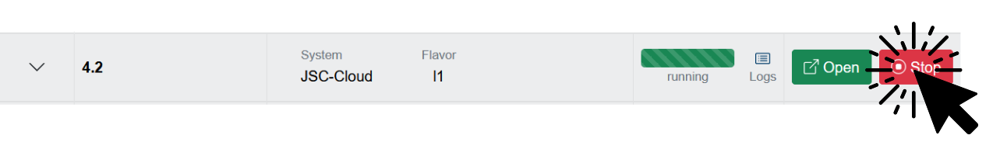
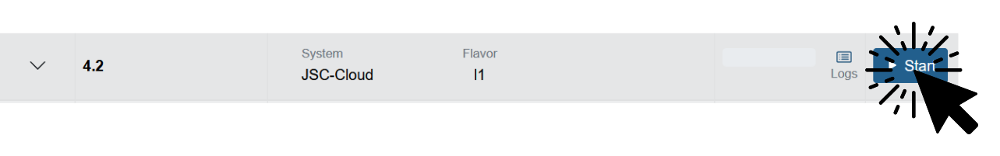
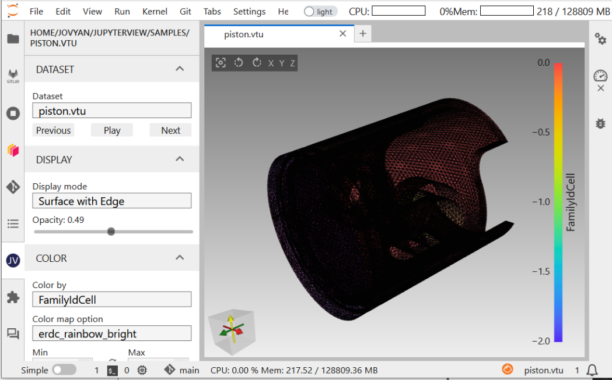

# JupyterLab 4.2

This is the current default version of JupyterLab on Jupyter4NFDI. In the next sections we will describe how you can modify it to fit your needs, and give a brief overview of the installed software.

## Systems Available

**JupyterLab 4.2** is available on these systems:

- **JSC-Cloud**

> On **JSC-Cloud** only files in `/home/jovyan` are stored persistently. Everything else will be lost after a restart.

## Pre-installed kernels
> The kernels listed in this documentation may not always be up-to-date, as they can change periodically. For the current list of available kernels, please check the web service. The configuration files used to install these kernels are stored [here in our GitHub repository](https://github.com/easybuilders/JSC/tree/2024/Golden_Repo/j).

- [Bash](https://github.com/easybuilders/JSC/blob/2024/Golden_Repo/j/JupyterKernel-Bash/JupyterKernel-Bash-0.9.3-GCCcore-12.3.0-4.2.1.eb)
- [Cling](https://github.com/easybuilders/JSC/blob/2024/Golden_Repo/j/JupyterKernel-Cling/JupyterKernel-Cling-20231018-GCCcore-12.3.0-4.2.1.eb)
- [Julia](https://github.com/easybuilders/JSC/blob/2024/Golden_Repo/j/JupyterKernel-Julia/JupyterKernel-Julia-1.9.3-GCCcore-12.3.0.eb)
- [LFortran](https://github.com/easybuilders/JSC/blob/2024/Golden_Repo/j/JupyterKernel-LFortran/JupyterKernel-LFortran-0.30.0-GCCcore-12.3.0.eb)
- [Octave](https://github.com/easybuilders/JSC/blob/2024/Golden_Repo/j/JupyterKernel-Octave/JupyterKernel-Octave-8.4.0-GCCcore-12.3.0-4.2.1.eb)
- [PyDeepLearning](https://github.com/easybuilders/JSC/blob/2024/Golden_Repo/j/JupyterKernel-PyDeepLearning/JupyterKernel-PyDeepLearning-2024.3-GCCcore-12.3.0-4.2.1.eb)
- [PyEarthSystem](https://github.com/easybuilders/JSC/blob/2024/Golden_Repo/j/JupyterKernel-PyEarthSystem/JupyterKernel-PyEarthSystem-2024.3-GCCcore-12.3.0-4.2.1.eb)
- [PyQuantum](https://github.com/easybuilders/JSC/blob/2024/Golden_Repo/j/JupyterKernel-PyQuantum/JupyterKernel-PyQuantum-2024.5-GCCcore-12.3.0-4.2.1.eb)
- [PyVisualization](https://github.com/easybuilders/JSC/blob/2024/Golden_Repo/j/JupyterKernel-PyVisualization/JupyterKernel-PyVisualization-2024.3-GCCcore-12.3.0-4.2.1.eb)
- [R](https://github.com/easybuilders/JSC/blob/2024/Golden_Repo/j/JupyterKernel-R/JupyterKernel-R-4.3.2-GCCcore-12.3.0-4.2.1.eb)
- [Ruby](https://github.com/easybuilders/JSC/blob/2024/Golden_Repo/j/JupyterKernel-Ruby/JupyterKernel-Ruby-3.2.2-GCCcore-12.3.0.eb)

You can select them by navigating to the **Kernels and Extensions** tab on the left side of your configuration.

<div style="text-align: center;">
  
</div>

## Kernel customization

> These tutorials were created for HPC systems. Kernel creation on cloud resources (like **JSC-Cloud**) might require different steps. We may offer some documentation specifically for cloud resources in the future.

- [Create kernel with virtualenv](kernels_venv.ipynb)
- [Create kernel with conda](kernels_conda.ipynb)
- [Create kernel with pyenv](kernels_pyenv.ipynb)
- [Create a containerized kernel with singularity](kernels_singularity.ipynb)
- [Modify or extend a running kernel](kernels_modify_runtime.ipynb)


## Extensions
> The extensions listed in this documentation may not always be up-to-date, as they can change periodically. For the current list of available extensions, please check the web service. The configuration files used to install these extensions are stored [here in our GitHub repository](https://github.com/easybuilders/JSC/tree/2024/Golden_Repo/j).

- [Jupyter AI](https://github.com/easybuilders/JSC/blob/2024/Golden_Repo/j/jupyter-ai/jupyter-ai-2.15.0-GCCcore-12.3.0.eb)
- [Jupyter Archive](https://github.com/easybuilders/JSC/blob/2024/Golden_Repo/j/jupyter-archive/jupyter-archive-3.4.0-GCCcore-12.3.0.eb)
- [Jupyter Bokeh](https://github.com/easybuilders/JSC/blob/2024/Golden_Repo/j/jupyter-bokeh/jupyter-bokeh-4.0.4-GCCcore-12.3.0.eb)
- [Jupyter Collaboration](https://github.com/easybuilders/JSC/blob/2024/Golden_Repo/j/jupyter-collaboration/jupyter-collaboration-2.1.1-GCCcore-12.3.0.eb)
- [Jupyter Resource Usage](https://github.com/easybuilders/JSC/blob/2024/Golden_Repo/j/jupyter-resource-usage/jupyter-resource-usage-1.0.2-GCCcore-12.3.0.eb)
- [Jupyter Server Proxy](https://github.com/easybuilders/JSC/blob/2024/Golden_Repo/j/jupyter-server-proxy/jupyter-server-proxy-4.1.2-GCCcore-12.3.0.eb)
- [Jupyter Slurm Provisioner](https://github.com/easybuilders/JSC/blob/2024/Golden_Repo/j/jupyter-slurm-provisioner/jupyter-slurm-provisioner-0.6.0-GCCcore-12.3.0.eb)
- JupyterLab Code Formatter
- JupyterLab favorites
- [JupyterLab Git](https://github.com/easybuilders/JSC/blob/2024/Golden_Repo/j/jupyterlab-git/jupyterlab-git-0.50.1-GCCcore-12.3.0.eb)
- [JupyterLab GitHub](https://github.com/easybuilders/JSC/blob/2024/Golden_Repo/j/jupyterlab-github/jupyterlab-github-4.0.0-GCCcore-12.3.0.eb)
- [JupyterLab GitLab](https://github.com/easybuilders/JSC/blob/2024/Golden_Repo/j/jupyterlab-gitlab/jupyterlab-gitlab-4.0.0-GCCcore-12.3.0.eb)
- [JupyterLab H5Web](https://github.com/easybuilders/JSC/blob/2024/Golden_Repo/j/jupyterlab-h5web/jupyterlab-h5web-12.1.0-GCCcore-12.3.0.eb)
- [JupyterLab LaTeX](https://github.com/easybuilders/JSC/blob/2024/Golden_Repo/j/jupyterlab-latex/jupyterlab-latex-4.0.0-GCCcore-12.3.0.eb)
- [JupyterLab nvdashboard](https://github.com/easybuilders/JSC/blob/2024/Golden_Repo/j/jupyterlab-nvdashboard/jupyterlab-nvdashboard-0.10.0-GCCcore-12.3.0.eb)
- [JupyterLab Recents](https://github.com/easybuilders/JSC/blob/2024/Golden_Repo/j/jupyterlab-recents/jupyterlab-recents-3.3.0-GCCcore-12.3.0.eb)
- JupyterLab Sidecar
- JupyterLab Spellchecker
- JupyterLab Tour
- JupyterLab Trame Manager
- [JupyterLab VariableInspector](https://github.com/easybuilders/JSC/blob/2024/Golden_Repo/j/jupyterlab-variableinspector/jupyterlab-variableinspector-3.2.1-GCCcore-12.3.0.eb)

> Most extensions are always loaded. Others can be activated to your liking in the **Kernels and Extensions** tab in your JupyterLab configuration.

## Install your own Extensions

One of the standout features of Jupyter4NFDI is the flexibility it offers users to install their own extensions. This allows users to fully customize their environment according to their specific needs, rather than being limited to the pre-installed tools. With just three easy steps, users can add any extension that fits their workflow. The following example shows the installation of the JupyterView Extension.

> The workflow outlined above has been tested specifically with [prebuilt extension](https://jupyterlab.readthedocs.io/en/latest/user/extensions.html#installing-extensions). Extensions that do not follow this standard might require extra steps for installation. For best results, request that the extension provider updates their software.

<h3>1. <strong>Install python package</strong></h3>
```
source /tmp/custom/load_jupyter_version.sh # This loads the jupyter environment
pip install --user jupyterview # or the extension you would like to install
```
You can check the success with these commands:  
```
source /tmp/custom/load_jupyter_version.sh # This loads the jupyter environment
jupyter labextension list
```
> You will find the installed extension in this list. The extension might be listed with the hint "enabled X" instead of "enabled OK", that should be an issue while using the extension.
<h3>2. <strong>Stop JupyterLab</strong></h3>
Browse to the [home](https://hub.nfdi-jupyter.de/hub/home) page and Stop your running JupyterLab.
<div style="text-align: center;">
  
</div>
<h3>3. <strong>Start JupyterLab</strong></h3>
Wait until the JupyterLab is fully stopped. Then start it again.
<div style="text-align: center;">
  
</div>
You should now be able to use the installed extension. 
If something's not working as expected, you may find additional information in the JupyterLab logs at `/tmp/custom/logs/stdout`.
<div style="text-align: center;">
  
</div>

## Uninstall your own Extensions
To remove the previously installed extension, you have to set `PYTHONNOUSERSITE` to `0`. Otherwise pip will not look into the locally installed packages. 
```
source /tmp/custom/load_jupyter_version.sh # This loads the jupyter environment
PYTHONNOUSERSITE=0 pip uninstall jupyterview
```
After a restart of your JupyterLab, the extension will be fully removed.

## Proxies

- MatLab
- [NEST Desktop](https://github.com/easybuilders/JSC/blob/2024/Golden_Repo/j/JupyterProxy-NESTDesktop/JupyterProxy-NESTDesktop-0.4.0-GCCcore-12.3.0-4.2.1.eb)
- RStudio
- [Xpra](https://github.com/easybuilders/JSC/blob/2024/Golden_Repo/j/JupyterProxy-XpraHTML5/JupyterProxy-XpraHTML5-0.4.0-GCCcore-12.3.0-4.2.1.eb)
