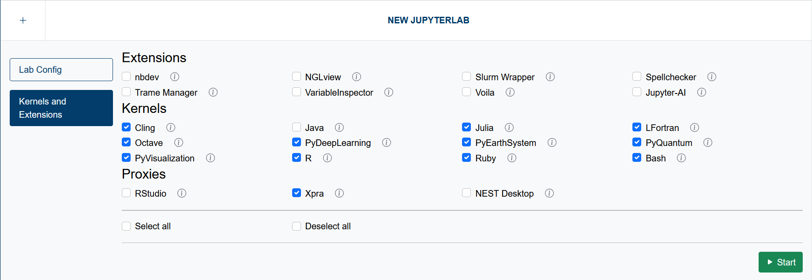

# JupyterLab 4.3

This is the current default version of JupyterLab on Jupyter4NFDI. In the next sections we will describe how you can modify it to fit your needs, and give a brief overview of the installed software.

## Systems Available

**JupyterLab 4.3** is available on these systems:

- **JSC-Cloud**

> On **JSC-Cloud** only files in `/home/jovyan` are stored persistently. Everything else will be lost after a restart.

## Pre-installed kernels
> The kernels listed in this documentation may not always be up-to-date, as they can change periodically. For the current list of available kernels, please check the web service. The configuration files used to install these kernels are stored [here in our GitHub repository](https://github.com/easybuilders/JSC/tree/2025/Golden_Repo/j).

- [Bash](https://github.com/easybuilders/JSC/blob/2025/Golden_Repo/j/JupyterKernel-Bash/JupyterKernel-Bash-0.9.3-GCCcore-13.3.0-4.3.4.eb)
- [Cling](https://github.com/easybuilders/JSC/blob/2025/Golden_Repo/j/JupyterKernel-Cling/JupyterKernel-Cling-1.2-GCCcore-13.3.0-4.3.4.eb)
- [Java](https://github.com/easybuilders/JSC/blob/2025/Golden_Repo/j/JupyterKernel-Java/JupyterKernel-Java-2.2.0-GCCcore-13.3.0.eb)
- [Julia](https://github.com/easybuilders/JSC/blob/2025/Golden_Repo/j/JupyterKernel-Julia/JupyterKernel-Julia-1.11.2-GCCcore-13.3.0.eb)
- [LFortran](https://github.com/easybuilders/JSC/blob/2025/Golden_Repo/j/JupyterKernel-LFortran/JupyterKernel-LFortran-0.42.0-GCCcore-13.3.0.eb)
- [Octave](https://github.com/easybuilders/JSC/blob/2025/Golden_Repo/j/JupyterKernel-Octave/JupyterKernel-Octave-9.3.0-GCCcore-13.3.0-4.3.4.eb)
- PyHPC
- [PyDeepLearning](https://github.com/easybuilders/JSC/blob/2025/Golden_Repo/j/JupyterKernel-PyDeepLearning/JupyterKernel-PyDeepLearning-2025.1-GCCcore-13.3.0-4.3.4.eb)
- [PyEarthSystem](https://github.com/easybuilders/JSC/blob/2025/Golden_Repo/j/JupyterKernel-PyEarthSystem/JupyterKernel-PyEarthSystem-2025.1-GCCcore-13.3.0-4.3.4.eb)
- [PyVisualization](https://github.com/easybuilders/JSC/blob/2025/Golden_Repo/j/JupyterKernel-PyVisualization/JupyterKernel-PyVisualization-2025.2-GCCcore-13.3.0-4.3.4.eb)
- [R](https://github.com/easybuilders/JSC/blob/2025/Golden_Repo/j/JupyterKernel-R/JupyterKernel-R-4.4.2-GCCcore-13.3.0-4.2.1.eb)
- [Ruby](https://github.com/easybuilders/JSC/blob/2025/Golden_Repo/j/JupyterKernel-Ruby/JupyterKernel-Ruby-3.4.1-GCCcore-13.3.0.eb)

You can select them by navigating to the **Kernels and Extensions** tab on the left side of your configuration.

  

## Kernel customization

> It might be easier to create your own environment using [Repo2Docker](../repo2docker/index.md).  
  
> Since JupyterLab 4.3 uses software loaded via lmod, one cannot simply install a kernel without loading these modules first. Please follow the steps in the these guides to create your own kernel.  

- [Create kernel with virtualenv](kernels_venv.ipynb)

## Extensions
> The extensions listed in this documentation may not always be up-to-date, as they can change periodically. For the current list of available extensions, please check the web service. The configuration files used to install these extensions are stored [here in our GitHub repository](https://github.com/easybuilders/JSC/tree/2025/Golden_Repo/j).

- Jupyter AI
- [Jupyter Archive](https://github.com/easybuilders/JSC/blob/2025/Golden_Repo/j/jupyter-archive/jupyter-archive-3.4.0-GCCcore-13.3.0.eb)
- [Jupyter Bokeh](https://github.com/easybuilders/JSC/blob/2025/Golden_Repo/j/jupyter-bokeh/jupyter-bokeh-4.0.5-GCCcore-13.3.0.eb)
- [Jupyter Collaboration](https://github.com/easybuilders/JSC/blob/2025/Golden_Repo/j/jupyter-collaboration/jupyter-collaboration-3.1.0-GCCcore-13.3.0.eb)
- [Jupyter Resource Usage](https://github.com/easybuilders/JSC/blob/2025/Golden_Repo/j/jupyter-resource-usage/jupyter-resource-usage-1.1.0-GCCcore-13.3.0.eb)
- [Jupyter Server Proxy](https://github.com/easybuilders/JSC/blob/2025/Golden_Repo/j/jupyter-server-proxy/jupyter-server-proxy-20250303-GCCcore-13.3.0.eb)
- [Jupyter Slurm Provisioner](https://github.com/easybuilders/JSC/blob/2025/Golden_Repo/j/jupyter-slurm-provisioner/jupyter-slurm-provisioner-0.6.0-GCCcore-13.3.0.eb)
- [JupyterLab Code Formatter](https://github.com/easybuilders/JSC/tree/2025/Golden_Repo/j/jupyterlab-code-formatter/jupyterlab-code-formatter-3.0.2-GCCcore-13.3.0.eb)
- [JupyterLab favorites](https://github.com/easybuilders/JSC/tree/2025/Golden_Repo/j/jupyterlab-favorites/jupyterlab-favorites-3.2.2-GCCcore-13.3.0.eb)
- [JupyterLab Git](https://github.com/easybuilders/JSC/blob/2025/Golden_Repo/j/jupyterlab-git/jupyterlab-git-0.50.2-GCCcore-13.3.0.eb)
- [JupyterLab GitHub](https://github.com/easybuilders/JSC/blob/2025/Golden_Repo/j/jupyterlab-github/jupyterlab-github-4.0.0-GCCcore-13.3.0.eb)
- [JupyterLab GitLab](https://github.com/easybuilders/JSC/blob/2025/Golden_Repo/j/jupyterlab-gitlab/jupyterlab-gitlab-4.0.0-GCCcore-13.3.0.eb)
- [JupyterLab H5Web](https://github.com/easybuilders/JSC/blob/2025/Golden_Repo/j/jupyterlab-h5web/jupyterlab-h5web-12.3.0-GCCcore-13.3.0.eb)
- ipyvue
- [Kernel Gateway](https://github.com/easybuilders/JSC/blob/2025/Golden_Repo/j/jupyter-kernel-gateway/jupyter-kernel-gateway-3.0.1-GCCcore-13.3.0.eb)
- [JupyterLab LaTeX](https://github.com/easybuilders/JSC/blob/2025/Golden_Repo/j/jupyterlab-latex/jupyterlab-latex-4.3.0-GCCcore-13.3.0.eb)
- nbdev
- NGLview
- [JupyterLab nvdashboard](https://github.com/easybuilders/JSC/blob/2025/Golden_Repo/j/jupyterlab-nvdashboard/jupyterlab-nvdashboard-0.12.0-GCCcore-13.3.0.eb)
- [JupyterLab Sidecar](https://github.com/easybuilders/JSC/tree/2025/Golden_Repo/j/jupyterlab-sidecar/jupyterlab-sidecar-0.7.0-GCCcore-13.3.0.eb)
- [JupyterLab Spellchecker](https://github.com/easybuilders/JSC/tree/2025/Golden_Repo/j/jupyterlab-spellchecker/jupyterlab-spellchecker-0.8.4-GCCcore-13.3.0.eb)
- [JupyterLab Tour](https://github.com/easybuilders/JSC/tree/2025/Golden_Repo/j/jupyterlab-tour/jupyterlab-tour-4.0.1-GCCcore-13.3.0.eb)
- JupyterLab Trame Manager
- [JupyterLab VariableInspector](https://github.com/easybuilders/JSC/blob/2025/Golden_Repo/j/jupyterlab-variableinspector/jupyterlab-variableinspector-3.2.4-GCCcore-13.3.0.eb)
- [JupyterView](https://github.com/easybuilders/JSC/blob/2025/Golden_Repo/j/jupyterview/jupyterview-0.7.0-GCCcore-13.3.0.eb)
- Voila

> Most extensions are always loaded. Others can be activated to your liking in the **Kernels and Extensions** tab in your JupyterLab configuration.

## Proxies

- [Xpra Remote Desktop](https://github.com/easybuilders/JSC/blob/2025/Golden_Repo/j/JupyterProxy-XpraHTML5/JupyterProxy-XpraHTML5-0.4.3-GCCcore-13.3.0.eb)
- [VSCode](https://github.com/easybuilders/JSC/blob/2025/Golden_Repo/j/JupyterProxy-VSCode/JupyterProxy-VSCode-0.9.3-GCCcore-13.3.0.eb)
- [RStudio](https://github.com/easybuilders/JSC/blob/2025/Golden_Repo/j/JupyterProxy-RStudio/JupyterProxy-RStudio-2024.12.0-GCCcore-13.3.0.eb)
- [NEST Desktop](https://github.com/easybuilders/JSC/blob/2025/Golden_Repo/j/JupyterProxy-NESTDesktop/JupyterProxy-NESTDesktop-0.4.0-GCCcore-13.3.0.eb)
