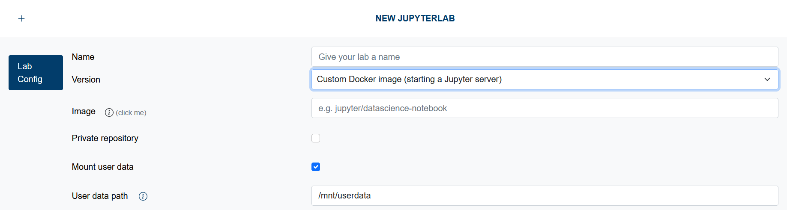

# Custom Docker Images

Users can leverage **Custom Docker Images**, enabling them to create and use tailored computing environments. This feature allows for pre-installed libraries and configurations specific to your project's requirements, enhancing reproducibility and collaboration.
You can use one of the many [jupyter images](https://jupyter-docker-stacks.readthedocs.io/en/latest/using/selecting.html) as a starting point, or start from scratch. The only **requirement** is that the Docker image must be capable of running the `jupyterhub-singleuser` command. This means it needs to have **JupyterHub installed**, ensuring compatibility with the JupyterHub infrastructure.

## Systems Available

**Custom Docker Images** are available on these systems:

- **deNBI-Cloud**
- **JSC-Cloud**

## Options

  

### Image
You can specify an image from Docker Hub, such as `jupyter/datascience-notebook`. You can also provide a link to another container registry, including the desired image, such as `https://registry.example.com/myimage:latest`.
> When using a private registry, make sure to provide the complete path, even though the registry URL is repeated in the subsequent section.

### Private Registry
If you wish to use a private registry, you must provide some additional information so that Jupyter4NFDI can retrieve the Docker image.

- **Image Registry**: Enter the URL of your private registry (e.g., `https://registry.example.com`).
- **Username**: Provide the username required to access the private registry.
- **Password**: Enter the password for accessing the private registry.

It’s recommended to use an access token or application credentials instead of your user account.

> The password will be stored in an encrypted format within the Jupyter4NFDI database. If you delete the JupyterLab configuration, the stored secret will be removed from the database.

### User data
The mount path for your persistent storage is optional and configurable. This flexibility ensures that the storage location does not interfere with the specific requirements of the Docker image you provide. You can easily adapt the mounting path to suit your environment, allowing for a seamless integration of your custom setup.

