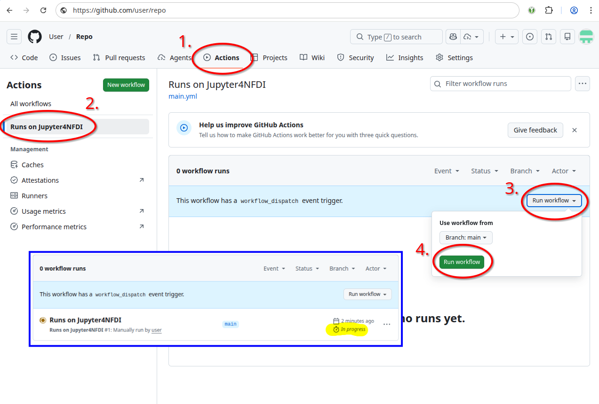

# Automated Notebook Validation

Over time, software environments evolve and dependencies change. This can cause notebooks that once worked to fail unexpectedly. The automated notebook validation service runs all notebooks in a clean Repo2Docker environment inside Jupyter4NFDI, ensuring that repositories remain compatible and reproducible.

## GitHub Action
  
The easiest way to run the automated notebook validation is GitHub Actions.  
   
### Create GitHub Action

1. **Get Jupyter4NFDI API Token** - Browse to https://hub.nfdi-jupyter.de/hub/token , log in and request a new API token. Give it a useful note like "_\<Repo>_ GitHub Action". Copy that token.
2. **Add Token to GitHub Environment** - Browse to your GitHub Repository. Click on **Settings**, **Environments** and **New environment**. Give it useful name like "jupyter4nfdi". Click on **Add environment secret**, enter `JUPYTERHUB_API_TOKEN` as Name and paste your token into value.
  
  
<div style="text-align: center;">
  
</div>  
  
   
3. **Add GitHub Action** - Browse to your GitHub Repository. Click on **Actions** and **set up your own workflow**. Afterwards copy the following text into it:
```
name: Runs on Jupyter4NFDI

on:
  workflow_dispatch:
  schedule:
    - cron: "0 7 * * 1"

jobs:
  notebooks:
    runs-on: ubuntu-latest
    environment: jupyter4nfdi
    steps:
      - name: Run notebooks via papermill on Jupyter4NFDI
        uses: NFDI-Jupyter/ghactions/.github/actions/notebooks@main
        with:
          repo: {{ github.repository }}
          ref: {{ github.ref_name }}
          # notebook_dirs: '["notebooks", "examples"]' # Only check specific folders in your repo
          token: {{ secrets.JUPYTERHUB_API_TOKEN }}          
```

<div style="text-align: center;">
    
</div>    
   
4. **Customize** - Update **schedule** in your workflow if required. Make sure the **environment** name is the one from step 2. If only specific folders should be check set **notebook_dirs** accordingly.
5. **Commit** - Click on **commit changes**. 

### Use GitHub Action
1. **Run Workflow** - Browse to your GitHub Repository. Click on **Actions**, **Runs on Jupyter4NFDI**, **Run workflow** and **Run workflow** again. After a few seconds you will see a running workflow.

<div style="text-align: center;">
    
</div>  

2. **Check Logs** - Once the workflow is finished you can click on **Runs on Jupyter4NFDI**, **notebooks** and **Run notebooks via papaermill on Jupyter4NFDI**. Scroll down to find the logs from papermill executing your notebooks. Example Output:  
  
```
Job URL: https://hub.nfdi-jupyter.de/hub/api/job/username/gf987pbdv0loadr48lep63etyr5r2csv
Job status: running
Job status: stopped

========== PAPERMILL LOGS ==========
{
  "exitCode": 0,
  "results": [
    {
      "notebook": "/home/jovyan/notebooks/notebook.ipynb",
      "exitCode": 0,
      "stdout": "Input Notebook:  /home/jovyan/notebooks/notebook.ipynb\nOutput Notebook: /tmp/tmpsv0i6e8b/notebook.ipynb\n\nExecuting:   0%|          | 0/2 [00:00<?, ?cell/s]Executing notebook with kernel: javascript\n\nExecuting:  50%|\u2588\u2588\u2588\u2588\u2588     | 1/2 [00:01<00:01,  1.29s/cell]\nExecuting: 100%|\u2588\u2588\u2588\u2588\u2588\u2588\u2588\u2588\u2588\u2588| 2/2 [00:04<00:00,  2.23s/cell]\n"
    }
  ]
}
===================================
Papermill job completed successfully
```

### Support
Feel free to [contact us](../../support.md) if you're having trouble setting up your GitHub Action.