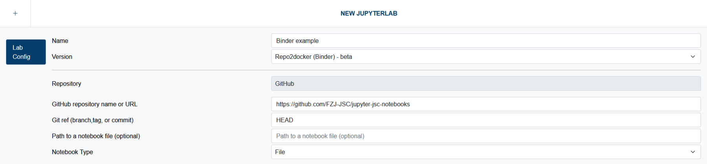

# Repo2Docker ( Binder )

Jupyter4NFDI offers **Repo2Docker ( Binder )**, which facilitates building Docker images directly from GitHub, GitLab, Zenodo or other sources. This capability allows users to easily set up environments that replicate their local development setups or share projects with others. Combined with the **[Direct Links](#direct-links)** or the [share](../../misc.md#share-button)** Button, it allows you easily to create FAIR digital objects.

> This service is currently in a beta stadium. We will continue working on it to bring more features and improvements.

## Direct Links

Jupyter4NFDI enables you to create links that automatically start a JupyterLab instance using the provided parameters.  
For example: [https://hub.nfdi-jupyter.de/r2d/gh/binder-examples/requirements](https://hub.nfdi-jupyter.de/r2d/gh/binder-examples/requirements){:target="_blank"}.  

The general structure for these direct links is:  
**`https://hub.nfdi-jupyter.de/r2d/_repotype_/_repoowner_/_reponame_/_ref_`**

### Parameters in the Link

| Parameter    | Description                                                                 |
|--------------|-----------------------------------------------------------------------------|
| `_repotype_` | Specifies the type of repository (currently, only `gh` is supported).      |
| `_repoowner_`| Identifies the owner of the repository (e.g., an organization or username). |
| `_reponame_` | The name of the repository containing the JupyterLab resources.            |
| `_ref_`      | *(Optional)* The branch, tag, or commit hash to use in the repository (e.g., `main` or `requirements`). Default: `HEAD`. |

### Query Arguments in the Link

The link also supports several **optional** query arguments to unlock additional features:

| Parameter    | Description                                                                 |
|--------------|-----------------------------------------------------------------------------|
| `labpath`    | Add a path (relative or absolute) to a file which will be opened when starting the session. **Important:** The path must be URL-encoded. For example, `/home/jovyan/README.md` should be written as `%2Fhome%2Fjovyan%2FREADME.md`. |
| `urlpath`    | Add a path to a url in your JupyterLab which will be opened when starting the sessions - e.g `voila`. **Important:** The path must be URL-encoded. |
| `system`     | Specifies the system on which to start the repository. Default: Any [system](../../../features.md#1-systems-available) available to the user. |
| `dataDir`    | Mounts the user's persistent storage on the selected [system](../../../features.md#1-systems-available) into the running session. **Important:** The path must be URL-encoded. For example, `/home/jovyan/work` should be written as `%2Fhome%2Fjovyan%2Fwork`. |
| `flavor`     | Defines a specific flavor for the session. The availability of flavors depends on the selected system. If unsure, consult technical support. |
  
Example: [https://hub.nfdi-jupyter.de/r2d/gh/binder-examples/requirements?system=JSC-Cloud&dataDir=%2Fhome%2Fjovyan%2Fwork](https://hub.nfdi-jupyter.de/r2d/gh/binder-examples/requirements?system=JSC-Cloud&dataDir=%2Fhome%2Fjovyan%2Fwork){:target="_blank"}

### Comparison with MyBinder

The Direct Link feature is inspired by MyBinder and utilizes the same backend. However, by incorporating authentication, we can offer persistent storage, unlocking new capabilities.

Unlike MyBinder, the data persists even after closing the browser window or revisiting the link at a later time—whether it's two days or two weeks later.

### Empowering Workshop Instructors

Workshop instructors can prepare their content on GitHub, and participants can easily access it by following a link like:  
[https://hub.nfdi-jupyter.de/r2d/gh/_repoowner_/_repo_?dataDir=%2Fhome%2Fjovyan%2Fwork](https://hub.nfdi-jupyter.de/r2d/gh/_repoowner_/_repo_?dataDir=%2Fhome%2Fjovyan%2Fwork){:target="_blank"}.

With the Direct Link feature, workshop instructors gain the ability to:  
- **Prepare Workshops in Advance**: Instructors can set up their workshops ahead of time using GitHub, allowing participants to easily access the environment without additional setup.  
- **Seamless Access for Participants**: Attendees can join the workshop simply by clicking the prepared link, instantly accessing the environment with all resources loaded.  
- **Persistent Data**: Unlike MyBinder, where sessions are ephemeral, the data in the session persists even after the browser is closed, ensuring participants can pick up where they left off—making it ideal for multi-day or follow-up workshops.  
- **Custom Environments**: Instructors can tailor the workshop environment to their specific needs, ensuring that all participants have the same setup and access to necessary resources.  
  
This capability provides instructors with a streamlined, hassle-free experience when hosting workshops, and it enhances the overall learning experience for participants.

### More to Come

In the future, we plan to introduce the option to mount external data storage locations, such as S3 buckets, directly into the running container. This feature will expand the potential for advanced data analysis and visualization.
  
  
The ability to mount external storage opens up several exciting possibilities:  
- **Separation of Data and Code**: Users can keep their datasets in external storage while maintaining their code repositories separately, enabling better modularity and flexibility.  
- **Scalable Data Access**: Large datasets can remain in optimized external storage systems without requiring local copies, reducing resource usage and improving scalability.  
- **Collaboration**: Multiple users can access the same external datasets, making collaborative projects more streamlined.  
- **Real-Time Updates**: Changes to the external storage (e.g., updated data in an S3 bucket) can be reflected immediately in the container, supporting dynamic workflows.  

These features will empower users to work more efficiently and tackle complex data workflows with ease.  

## Systems Available

**Repo2Docker ( Binder )** is available on these systems:

- **JSC-Cloud**

## Options

  

### Repository Type

- **Description:** Select the type of repository where your project is hosted. Currently only GitHub is supported. Other options will be added in the future:
  - **GitHub:** The most common choice for code repositories.
- **Purpose:** This determines how Repo2Docker connects to and retrieves your repository content.

### URL

- **Description:** Enter the full URL of your repository. For GitHub, this is typically in the format `https://github.com/username/repository-name`.
- **Purpose:** This is the source that Repo2Docker will use to build your containerized environment. Make sure the URL is accessible and public or configured for access.

### Git Ref

- **Description:** Specify a reference for the desired version of your repository.
  - **Branch name:** e.g., `main`, `dev`
  - **Tag:** Use release tags, such as `v1.0`
  - **Commit hash:** Input a specific commit ID, useful for precise versions
  - **Custom references:** Use `HEAD~n` or `@~n` to go back `n` commits from the latest commit.
- **Purpose:** Allows you to control exactly which version of the repository is used, ensuring reproducibility.

### Path to a Notebook File or URL

- **Description:** Optionally, provide the path to a specific notebook file within your repository, e.g. `notebooks/example.ipynb`, or a URL, e.g. `voila`/`doc/tree/example.ipynb`, to open.
- **Purpose:** If filled, the specified notebook will open automatically once the environment is launched, simplifying access to a main file.

## Persistence and Shared Environments

> If you use [Direct Links](#direct-links) with the `?dataDir=` [Query Arguments](#query-arguments-in-the-link) you can already use persistent storage. This feature will come to the frontend within the next months.

Changes made within the running JupyterLab environment are **not persistent**. This means:

- **Non-Persistent** Changes: Any modifications made to files or settings in the current JupyterLab session will be lost when the session is closed. They are only visible to the current user session and will not persist across restarts.
- **No Shared State**: If you share a link to your environment, other users who start a JupyterLab session from that link will see the repository's original content, not any changes you’ve made in your session.
- **No Persistent Storage**: The current Repo2Docker setup does not support persistent storage. If you need to save your work, download any necessary files before closing the session.

> In the future, we plan to add persistent storage, allowing you to mount **your persistent data** directly into the session when it starts.