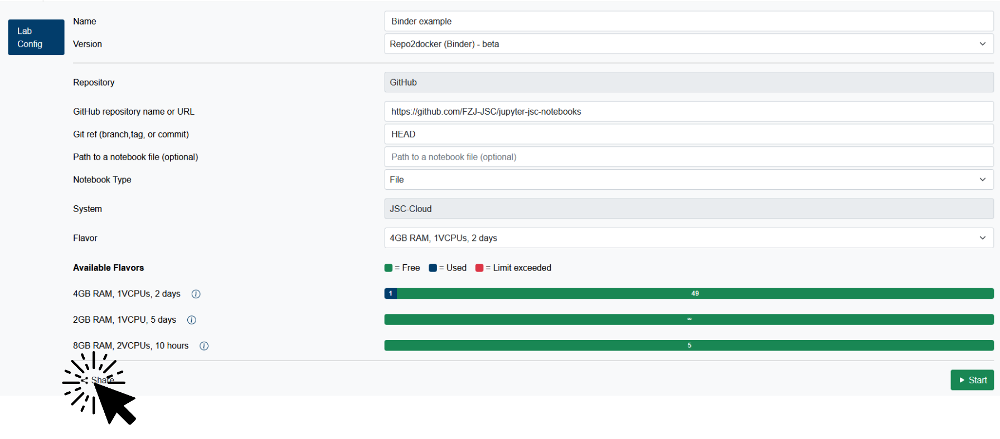
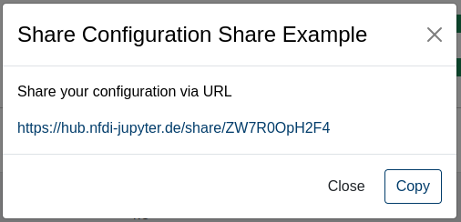
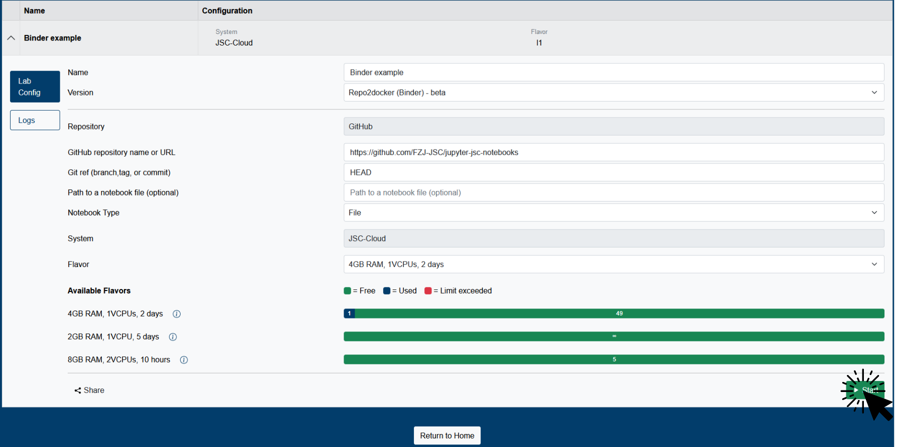

# Share Button
In Jupyter4NFDI you can share your current configuration with your colleagues. In combination with the **CustomDockerImage** or **Repo2Docker (Binder)** services, it allows you to easily create FAIR digital objects.  

## Create share link

<ol start="1">
  <li>Click on the share button in the bottom left corner of your configuration.</li>
</ol>
  

  

<ol start="2">
  <li>That's it. You can copy it and share it with your colleagues.</li>
</ol>

  

## Use a share link
1. Follow the link.
> If you're not already authenticated, you have to log in first. For more information check [this section](../authentication.md). Afterwards you'll be forwarded to the desired destination.

2. You will see the shared configuration. Click on Start to start the service.

  

