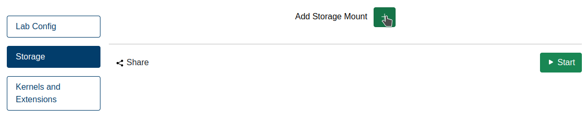

# JupyterLab DataMount

## Overview
Jupyter4NFDI uses the [JupyterLab DataMount](https://jsc-jupyter.github.io/jupyterlab-data-mount/) extension to provide seamless access to external storage services directly within JupyterLab. By integrating multiple storage backends, it allows users to mount and interact with remote data effortlessly. The extension is especially useful for researchers and data analysts who need quick and secure access to large datasets.

For more information about this extension click [here](https://jsc-jupyter.github.io/jupyterlab-data-mount/)

## Frontend Integration
The JupyterLab DataMount extension allows users to configure mount points before starting a JupyterLab. In Jupyter4NFDI users you do this by clicking on "Add Storage Mount" in the "Storage" tab.

  

You can configure multiple storage locations from different location, or use the same location mulitple times.

  

## Share Button + Storage Mount

> ⚠️ **Warning:** We recommend to only share **readonly** storage mounts.  
> Sharing mounts with **read-write** access allows other users to write, manipulate, or delete your data.  
> While technically possible, **read-write sharing should only be used if you fully trust your collaborators**.  
> Anyone who knows the **share ID** can access the mount—it's not listed publicly, but you should still treat the link as sensitive.

The **JupyterLab DataMount extension**, in combination with the [Share Button](misc.md/#share-button), enables **secure and seamless collaboration** using external storage—without ever exposing your credentials.

### Secure by Design

- When mounting external storage (e.g., S3, WebDAV, B2DROP), **your secrets stay private**.
- All sensitive information (access tokens, passwords, etc.) is **stored encrypted** in the backend and **never exposed to other users**.
- The actual mounting process runs in a **dedicated sidecar container**, isolated from the JupyterLab user environment—**so users cannot inspect, extract, or misuse secrets**, even with full shell access.

### Share Without Risk

- Use the Share Button to grant collaborators **access to your mounted storage**—without giving them your credentials.
- Recipients get temporary, secure access to **the mount itself**, not the underlying secrets.
- You control visibility, scope, and revocation.

### Example Use Cases

- A data steward sets up a shared WebDAV folder and gives researchers access via the Share Button.
- A lab technician mounts an S3 bucket with experimental data and shares read-only access with collaborators in another institution.
- A team leader creates a B2DROP mount for a shared project folder and distributes access to students—with zero configuration needed on their side.

### Why It Matters

This approach is **one-of-a-kind in the Jupyter ecosystem**, as far as we know. While some services allow mounting external storage, **very few (if any) combine it with user-level sharing and strict secret isolation**—all without requiring users to write a single line of code.

Together, the Share Button and DataMount extension **unlock the full collaborative potential** of Jupyter4NFDI: making storage sharing as easy as notebook sharing, while keeping security airtight.

---

## Feedback Welcome!

Is your preferred storage system not yet supported?  
Do you need a specific protocol, platform, or authentication method?

We’re actively improving the DataMount extension—and your feedback helps us prioritize new features.

**Please create an issue at our GitHub repository:**  
[https://github.com/jsc-jupyter/jupyterlab-data-mount/issues](https://github.com/jsc-jupyter/jupyterlab-data-mount/issues)

