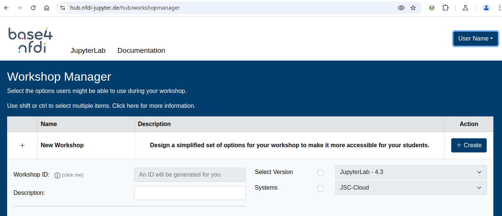
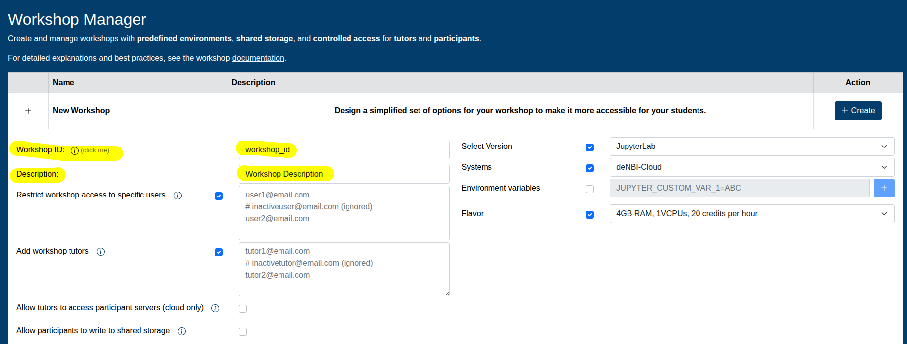
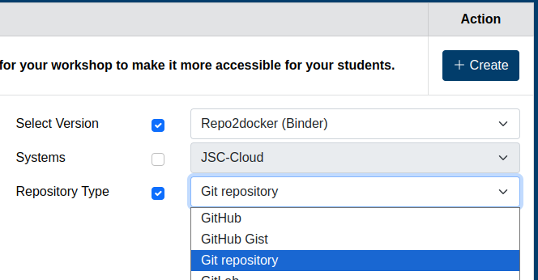
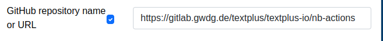
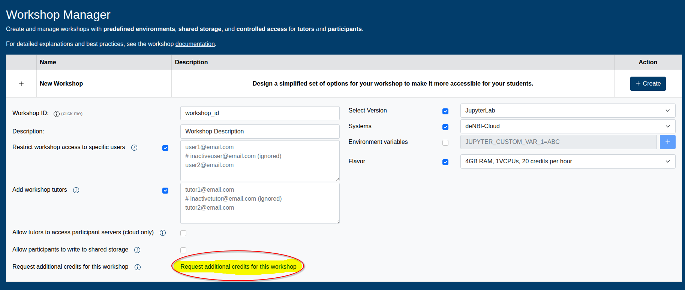

# Manage Workshops

There are no special requirements to use Jupyter4NFDI for a workshop. In most cases, you can use the platform exactly as you would for your regular work. Participants simply log in using one of the supported [authentication methods](authentication.md){:target="_blank"}.  

For workshops with more specific needs, Jupyter4NFDI provides additional features to support instructors and tutors. These include controlled environments, shared storage on cloud resources for preparing workshop-specific kernels, and optional collaboration features such as tutor access to participant sessions.

> If you plan to host a workshop, we kindly ask you to let us know in advance ( [Contact](support.md){:target="_blank"} ). This helps us take your event into account when scheduling maintenance and ensures a smooth experience for all participants.

## Motivation

Organizing a workshop often involves more than just providing teaching material. Instructors need to coordinate access for participants, prepare notebooks and presentations, and ensure that everyone works in a consistent and functional environment.  
  
Without guidance, participants may accidentally select unsuitable configurations when starting a service - for example, an incorrect system, kernel, or Docker image. While these misconfigurations may not always fail immediately, they can lead to inconsistent behaviour or non-functional environments during the workshop.  
  
Jupyter4NFDI addresses these challenges by offering dedicated workshop features that simplify preparation and execution:  
  
- **Controlled environments** ensure that all participants start with comptabile configurations.  
- **Shared storage on cloud resources** allows instructors or tutors to prepare kernels, environments, or data once and make them available for the entire workshop.  
- **Session access** enabled designated tutors to temporarily join participant JupyterLab sessions for live support and troubleshooting.  
- **Restricted participant lists** allow workshops to be limited to specific users, which can also enable qualification for additional workshop-specific credits.  
    
  
Together, these features reduce setup overhead, minimize configuration errors, and create a more reliable and supportive learning environment for both instructors and participants.

## Managing Workshops

The **Instructor** is the owner and primary administartor of a workshop. This role is responsible for creating the workshop, defining its configuration and managing access for tutors and participants.  
  
All workshop-related settings are managed through the [**Workshop Manager Page**](https://hub.nfdi-jupyter.de/workshopmanager){:target="_blank"}.

  

  

## Responsibilities of the Instructor
As an instructor, you can:  
  
- Create and manage workshops via the Workshop Manager Page  
- Control who may participate in the workshop and configure shared storage  
- Define the available runtime environment (allowed systems, versions and configuration options)  
- Assign tutors and define their permissions  
  

### Creating a workshop
  
Open the [**Workshop Manager Page**](https://hub.nfdi-jupyter.de/workshopmanager){:target="_blank"} and click on "New Workshop" to expand the workshop creation form.
  
- Choose a unique identifier for your workshop. The workshop will be reachable at *https://hub.nfdi-jupyter.de/workshops/_id_*. Allowed characters: `a-z 0-9 _ -` . Must start with a lowercase letter `([a-z][a-z0-9_-]*)`.  
- Provide a short description of the workshop. This text is displayed on the workshop page and helps participants understand the purpose and scope of the event.
  

  

  
  
That's all you need to create your first workshop. Additional options can be configured later and do not require changing the workshop link.

### Shared storage and restricted participants
Workshops can optionally be restricted to a specific list of participants. When participant restriction is enabled, the workshop automatically receives **50 GB of shared storage** on supported cloud resources (currently deNBI-Cloud and JSC-Cloud).
  
This shared storage can be used by instructors and tutors to prepare environments, kernels, and data for the workshop.  
  
Participants are identified by their **email adress**. If a user is unsure which email adress is associated with their account, they can visit [https://hub.nfdi-jupyter.de/hub/login?next=/hub/api/user](https://hub.nfdi-jupyter.de/hub/login?next=/hub/api/user){:target="_blank"}, login and look for a group name starting with the prefix `"email:"`. 

You can also configure the access level to the shared storage, allowing participants either **read-only** access or **read-write** access, depending on the requirements of your workshop.
  

  

  

### Runtime Environment
On the right-hand side of the form, you can predefine the runtime environment for your workshop. This allows you to control which options are available to participants when they visit the workshop website.
  
You may, for example, preselect or restrict:  
  
- The target system or service  
- Flavors  
- Environment variables  
- Specific Docker images  
- Repo2Docker-based configurations  
  
By defining these settings in advance, you prevent common configuration mistakes and ensure that all participants work in a consistent and reproducible environment throughout the workshop.

  

  

### Tutor configuration
You can assign one or more users as **Tutors** for your workshop.
  
Tutors always receive read-write access to the shared workshop storage. In addition, you may optionally allow tutors to **join participant JupyterLab sessions** to provide live support and troubleshooting, using the [JupyterLab Real Time Collaboration feature](https://jupyterlab.readthedocs.io/en/stable/user/rtc.html){:target="_blank"}.

Participants are always informed if tutors are permitted to access their JupyterLab sessions.

> Changes to tutor access permissions apply only to newly started sessions. Running JupyterLab servers are not affected.

  

  

### Requesting Additional Workshop Credits
When hosting a workshop, the default personal credits of participants may not be sufficient, especially for sessions that require longer runtimes or increased computational resources.  
  
To support such scenarios, instructors can request additional credits specifically for a workshop.
  
On the workshop page, instructors will find a “Request additional credits for this workshop” link. Clicking this link opens a pre-filled email draft addressed to the Jupyter4NFDI support team.  
  
The email template includes the most important information needed to process the request, such as:  
  
- Workshop ID  
- Workshop date  
- Target cloud system (e.g. JSC-Cloud, deNBI-Cloud)  
- Expected number of participants  
- Expected resources per participant (CPU, RAM)  
- Optional additional remarks  
  
Instructors only need to review the information, fill in any missing details, and send the email. The support team will then review the request and get back to you if further clarification is required.
  
Additional credits are granted on a per-workshop basis and are intended exclusively for the duration of the specified workshop.
  

  

> Having issues setting up your workshop? Feel free to [contact us](support.md).  