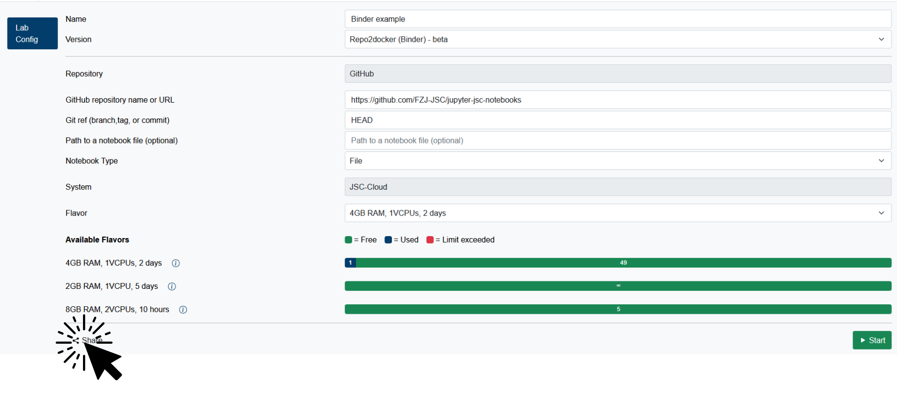

# Workshops

There are no special requirements to use Jupyter4NFDI for a workshop, you can simply use the platform as you normally would. In this section, we cover some best practices for workshops.

> If you plan to host a workshop, we kindly ask you to let us know in advance ( [Contact](support.md){:target="_blank"} ). This helps us take your event into account when scheduling maintenance and ensures a smooth experience for all participants.

## Motivation

Organizing workshops can be a complex task. Instructors must coordinate participant access, prepare materials such as presentations and Jupyter notebooks, and ensure that all components run reliably for every participant. Due to the wide range of options available when starting a service, users may inadvertently select incorrect configurations, such as the wrong system, kernel, or Docker image. These misconfigurations may not trigger immediate errors, but they can result in a non-functional or inconsistent runtime environment.

To address these challenges and streamline the workshop experience, we offer the ability to create a dedicated **Workshop Website**. This site allows instructors to define a controlled environment for their workshop, which can then be shared with participants.

## Managing Workshops (for Instructors)

### Available Options

As a workshop instructor, you may want to provide participants with a specific environment for your course. Depending on your needs, we offer three different ways to share your desired configuration:

1. **Share Links**: A fixed configuration shared via a link that cannot be changed afterward.  
    * **Pro**: Secrets (such as credentials for a private Docker registry) remain hidden from participants.  
    * **Pro**: Works with any type of configuration.  
    * **Contra**: Any changes to the configuration require generating a new link.

2. **Repo2Docker Direct Links**: Links that point directly to your Git repository.  
    * **Pro**: Supports various external sources like Git repositories, Zenodo, and more ([Repo2Docker](users/jupyterlab/repo2docker/index.md){:target="_blank"}).  
    * **Contra**: Configuration changes may require a minor update to the link.  
    * **Contra**: Only works with Repo2Docker.

3. **Workshop Configuration**: A curated selection of allowed environments.  
    * **Pro**: Define a controlled set of available options for your participants.  
    * **Pro**: You can update the configurations at any time without changing the link.

### [Share Links](users/misc.md#share-button){:target="_blank"}

To use Share Links in your workshop, go to the <a href="https://hub.nfdi-jupyter.de", target="_blank">Jupyter4NFDI service</a>, log in, and configure the environment you want participants to use. Once everything is set up, click the <strong>Share</strong> button to generate a unique link, which you can then distribute to your participants.

Keep in mind: if you make any changes to the configuration, a <strong>new share link</strong> will be generated. Be sure to share the updated link with your participants if any modifications are made.

> If a configuration includes secrets, they will remain hidden from other users. Instead of the actual values, participants will only see placeholders — but the original secrets entered when creating the share link will still be applied during startup.

### [Repo2Docker Direct Links](users/jupyterlab/repo2docker/index.md#direct-links){:target="_blank"}

Repo2Docker Direct Links are a great option when you want to launch a specific Git repository — other sources like Zenodo are also supported. Simply place your notebooks and their dependencies into the repository (see the [Repo2Docker / Binder Documentation](https://mybinder.readthedocs.io/en/latest/tutorials/reproducibility.html){:target="_blank"}) to define your custom environment. All required packages will be automatically installed.

By using the `urlpath` or `labpath` query parameters, participants can jump directly into JupyterLab with the desired file already open.

If you use `HEAD` as the reference, the Direct Link will always reflect the latest version of your repository. This makes it easy to update notebooks or dependencies without needing to change the link.

### Workshop Configuration

Instructors can visit the [Workshop Manager Website](https://hub.nfdi-jupyter.de/workshopmanager){:target="_blank"} to configure and manage their own workshops.
This will create a subset of the available options in Jupyter4NFDI.

[https://hub.nfdi-jupyter.de/workshopmanager](https://hub.nfdi-jupyter.de/workshopmanager){:target="_blank"}

  

  

Each instructor can define a subset of configuration options that are permitted during the workshop. These settings are then made accessible to participants via a unique "Workshop Link." You may edit your workshop configuration at any time. Clicking **"Create"** (or **"Share"** for existing workshops) will provide you with a personalized link to distribute.

#### Workshop ID

By default, a randomly generated ID is assigned when a new workshop is created. This ID forms the URL for the workshop, such as:

https://hub.nfdi-jupyter.de/workshops/_id_

If you prefer a custom identifier (e.g., `myworkshop2025`), please contact support to enable this feature for your account.

#### Description

Include a short description of your workshop. This will be displayed on the corresponding workshop page, helping users verify they are on the correct site.

#### Configuration Options

Each available option includes a checkbox. If a checkbox is **not** selected, users will retain access to **all** available values for that option. To restrict user selection, ensure the checkbox is checked and specify the allowed values.

  

  

##### Dropdown Menus

For dropdown selections, multiple values may be chosen using **CTRL+Click** or **SHIFT+Click**. At least one value must be selected for the configuration to be valid. If multiple values are selected, a default value can be specified.

  

  

##### Input Fields

Input fields can be used to enforce specific values (e.g., setting the runtime to 30 minutes or nodes to 1). If the checkbox next to an input field is selected, the defined value will be enforced. If the checkbox is left unchecked, users may input their own value when starting a service.

  

  

#### Expert Mode

Instructors who are part of the **Workshop Instructor** group gain access to additional features, such as:

- Creating custom workshop IDs
- Activating **Expert Mode** during workshop creation

Expert Mode enables the selection of multiple services and systems. However, this mode is disabled by default, as it introduces a higher risk of invalid configurations. For instance, selecting both JURECA and JUWELS as systems, but allowing only the partition `dc-cpu` (which is not available on JUWELS), will result in an unusable setup.

> To join the Workshop Instructor group contact support.

### Workshop Website

The workshop website will show the regular configuration interface. However, only the options pre-defined by the instructor will be available for selection.

  

  

> Having issues setting up your workshop? Feel free to [contact us](support.md).